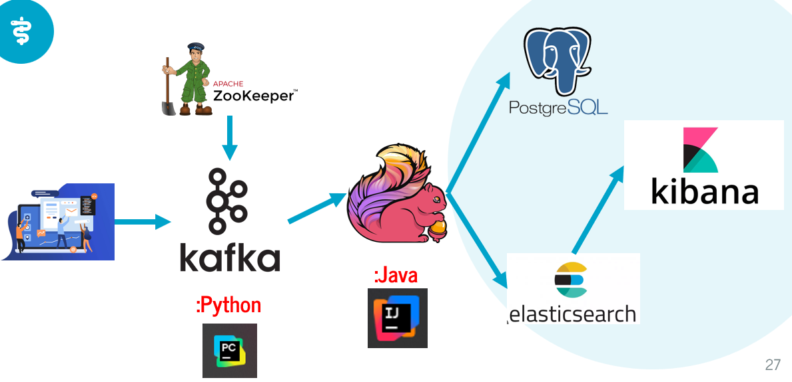
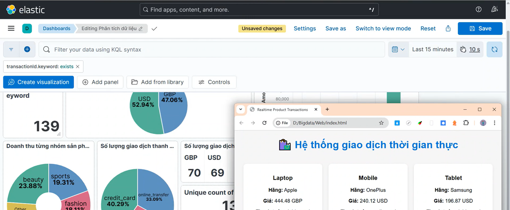
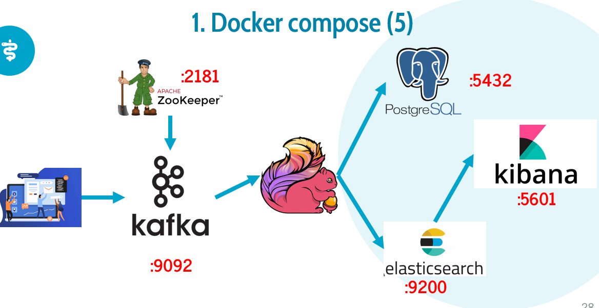
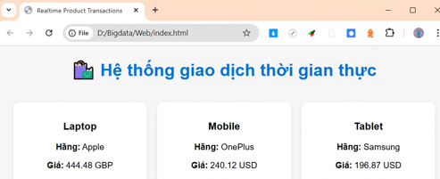
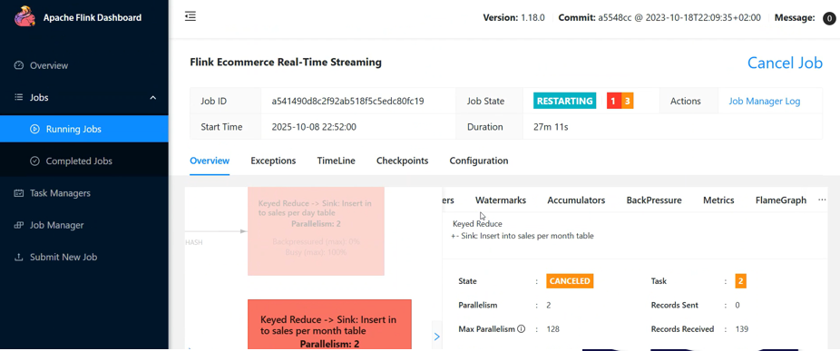

Real-time User Behavior Analytics Pipeline

This project is a real-time data pipeline built to capture, process, and analyze user
behavior from a web application. It uses Apache Flink for stream processing,
Kafka for data ingestion, and visualizes insights on a Kibana dashboard.

📸 Demo - Visuals

Video demo: https://drive.google.com/file/d/1dlEM5IrWJZnC5bRWZtJZuJOdkfGwkuOO/view

🛠 Tech Stack

Data Engineering: Apache Flink, Apache Kafka, Elasticsearch, PostgreSQL

Backend: Python, Java

Frontend: HTML, CSS, Javascript

Visualization: Kibana

✨ Features

Real-time Processing: Handle user data streams in real time using Apache Flink.

Data Visualization: Display insights and metrics interactively on Kibana dashboards.

⚙️ Installation & Setup

Follow these steps to run the project locally:

1. Clone the repository

2. Start all services with Docker Compose

docker compose up -d

This will start Kafka, ZooKeeper, Elasticsearch, PostgreSQL and Kibana containers.

3. Run index.html and bigdata.py

This script connects to Kafka and initializes user event data streams.

4. Start the Flink job

Upload and run the compiled JAR file for the Flink job (e.g., flink_job.jar).

5. Launch Kibana Dashboard

